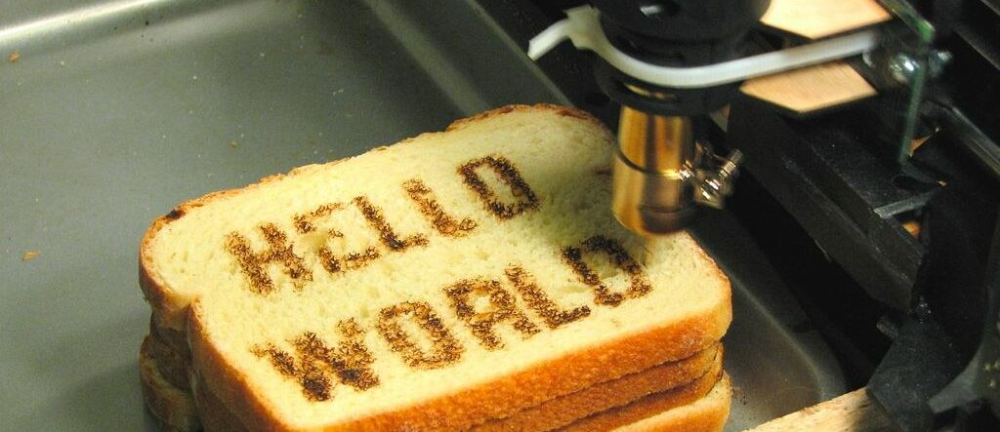

I have re-enabled the internal Docusaurus blog and, starting today, this space will be one of the reference points for Nebula project updates (the main one is and will remain my personal blog, but this is where English translations of those same articles can live, along with micro-updates that may have an impact on end users).

:::note Credits
Original photograph: https://www.flickr.com/photos/oskay/472097903
:::

Here I will publish quick updates about:

- changes and improvements across the Nebula module family (or scripts);
- technical updates that affect scripts and automation workflows;
- Microsoft 365 announcements that can directly impact module development.

The goal is simple: keep a clear history of decisions, changes, and recommended actions so development, maintenance, and daily usage stay aligned.
